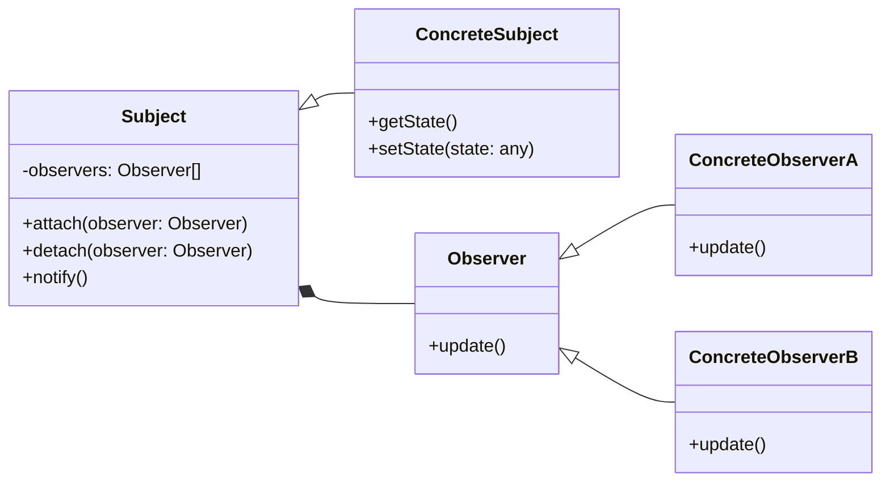

# Observer Pattern
The Observer pattern is a behavioral design pattern that allows objects to subscribe and receive notifications from one or more publishers (also known as subjects) when there is a change in their state. This pattern helps to decouple the subscriber and the publisher, allowing them to evolve independently without the need for constant polling.


## Python implementation:

```python
class WeatherStation:
    def __init__(self):
        self._observers = set()
        self._temperature = None

    def attach(self, observer):
        self._observers.add(observer)

    def detach(self, observer):
        self._observers.remove(observer)

    def notify(self):
        for observer in self._observers:
            observer.update(self)

    @property
    def temperature(self):
        return self._temperature

    @temperature.setter
    def temperature(self, temp):
        self._temperature = temp
        self.notify()  # Notify all observers when temperature changes

class WeatherObserver:
    def update(self, subject):
        raise NotImplementedError

# Concrete Observers for different display devices
class MobileAppDisplay(WeatherObserver):
    def update(self, subject):
        print(f"MobileAppDisplay: New temperature is {subject.temperature}°C")

class DesktopDashboard(WeatherObserver):
    def update(self, subject):
        print(f"DesktopDashboard: New temperature is {subject.temperature}°C")

class OutdoorDisplay(WeatherObserver):
    def update(self, subject):
        print(f"OutdoorDisplay: New temperature is {subject.temperature}°C")

# Client code: Creating the WeatherStation (Subject) and different displays (Observers)
weather_station = WeatherStation()

mobile_display = MobileAppDisplay()
desktop_display = DesktopDashboard()
outdoor_display = OutdoorDisplay()

# Attaching observers
weather_station.attach(mobile_display)
weather_station.attach(desktop_display)
weather_station.attach(outdoor_display)

# Simulate temperature changes
weather_station.temperature = 25  # Notifies all observers with the new temperature
weather_station.temperature = 30  # Notifies all observers again

# Detach one observer and update state
weather_station.detach(outdoor_display)
weather_station.temperature = 20  # Only MobileAppDisplay and DesktopDashboard get the update


```
# JavaScrip implementation:

```js
class Subject {
  constructor() {
    this.observers = new Set();
    this.state = null;
  }

  attach(observer) {
    observer.subject = this;
    this.observers.add(observer);
  }

  detach(observer) {
    observer.subject = null;
    this.observers.delete(observer);
  }

  notify() {
    for (const observer of this.observers) {
      observer.update();
    }
  }
}

class Observer {
  constructor() {
    this.subject = null;
  }

  update() {
    throw new Error('update() method must be implemented.');
  }
}

class ConcreteObserverA extends Observer {
  update() {
    console.log('ConcreteObserverA received the update.');
  }
}

class ConcreteObserverB extends Observer {
  update() {
    console.log('ConcreteObserverB received the update.');
  }
}

const subject = new Subject();
const observerA = new ConcreteObserverA();
const observerB = new ConcreteObserverB();

subject.attach(observerA);
subject.attach(observerB);

subject.state = 123;

subject.detach(observerA);

subject.state = 'Hello, world!';

```

## [Back to main](../readme.md)
