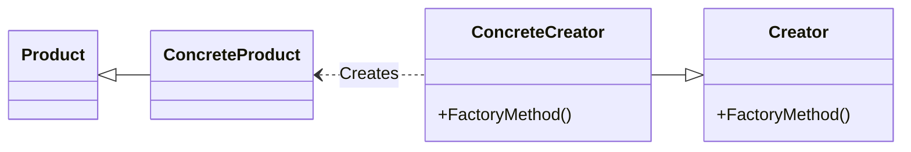

# Factory method
Defines an interface for creating an object but let subclasses decide which class to
instantiate
---

## implemetation in python:
<a href="https://en.wikipedia.org/wiki/ConcreteCreator_pattern#:~:text=The%20ConcreteCreator%20pattern%20is%20a,Gang%20of%20Four%20design%20patterns." target="_blank">WIKIPEDIA ConcreteCreator PATTERN</a>

```python
from abc import ABC, abstractmethod

# Step 1: Create the Animal interface with a factory method
class Animal(ABC):
    @abstractmethod
    def speak(self):
        pass

# Step 2: Concrete classes implement the Animal interface
class Dog(Animal):
    def speak(self):
        return "Woof!"

class Cat(Animal):
    def speak(self):
        return "Meow!"

# Step 3: Create a Factory class responsible for creating objects
class AnimalFactory:
    @staticmethod
    def get_animal(animal_type: str) -> Animal:
        if animal_type == "dog":
            return Dog()
        elif animal_type == "cat":
            return Cat()
        else:
            raise ValueError(f"Unknown animal type: {animal_type}")

# Step 4: Client code that uses the factory
if __name__ == "__main__":
    # Create a dog
    animal = AnimalFactory.get_animal("dog")
    print(animal.speak())  # Output: Woof!

    # Create a cat
    animal = AnimalFactory.get_animal("cat")
    print(animal.speak())  # Output: Meow!

    # Attempting to create an unknown animal type
    try:
        unknown_animal = AnimalFactory.get_animal("bird")
    except ValueError as e:
        print(e)  # Output: Unknown animal type: bird
```
# Implementation in JavaScript:

```js
class Product {
  constructor(name) {
    this.name = name;
  }
}

class ProductFactory {
  createProduct(name) {
    return new Product(name);
  }
}

// Usage
const factory = new ProductFactory();
const product = factory.createProduct("Product 1");
console.log(`Created ${product.name}`);

```

## [Back to main](../readme.md)
